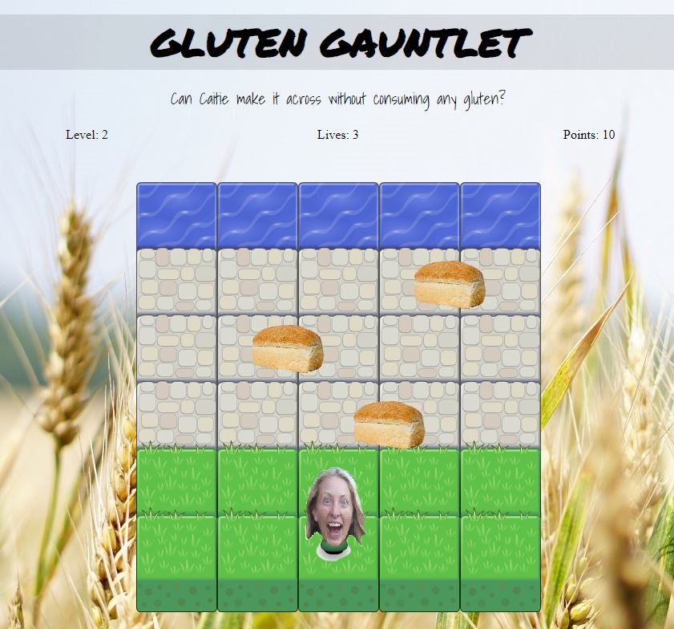

# Classic Arcade Game - Gluten Gauntlet

## Description

The objective is to get the player to the water without colliding into the bread. The player can move up, down, left and right. When the player reaches the water, she will reset to the start position and the bread will move faster. The player will receive points each time they reach the water. The game will end when the player loses all 3 lives provided, which are lost when there is a collision with a loaf of bread. 

## How to load the game

1. Download or clone the [repo](https://github.com/randiU/frontend-nano-degree-arcade-game.git).
2. Open `index.html` file in your browser.

## Resources used to create the game

* [Udacity GitHub](https://github.com/udacity/frontend-nanodegree-arcade-game.git)

* https://developer.mozilla.org/en-US/docs/Web/JavaScript/Reference/Global_Objects/Math/random

* https://github.com/lacyjpr/arcade

* https://github.com/brenopolanski/udacity-classic-arcade-game-clone/blob/master/js/app.js

* https://javascript.info/settimeout-setinterval

* http://api.jquery.com/text/

